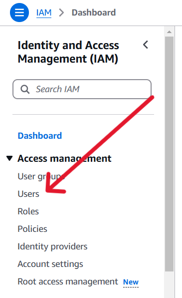

## Overview

[Amazon Redshift](https://docs.aws.amazon.com/redshift/latest/mgmt/welcome.html) is a powerful and fully-managed data warehouse service provided by Amazon Web Services (AWS), designed to efficiently analyze large datasets with high performance and scalability.

The `ballerinax/aws.redshiftdata` package allows developers to interact with Amazon Redshift Data API seamlessly using Ballerina. The Redshift Data API simplifies data access by eliminating the need for managing persistent database connections or the Redshift JDBC driver.

### Usage Options

The Redshift Data Ballerina Connector can be used in two ways:

1. **Redshift Cluster**: Connect directly to a provisioned Amazon Redshift cluster.
2. **Serverless Mode**: Leverage the serverless capabilities of the Redshift Data API, which is particularly suited for applications that need to scale dynamically without managing infrastructure.

## Setup guide: Cluster

To use the Ballerina AWS Redshift data connector, follow these steps to set up an Amazon Redshift cluster:

### Step 1: Login to AWS Console

Log into the [AWS Management Console](https://aws.amazon.com/).

### Step 2: Navigate to Amazon Redshift and create a cluster

1. In the AWS Management Console, search for Redshift in the services search bar.
1. Click on Amazon Redshift.
   

1. Click on the `Create cluster` button to initiate the process of creating a new Amazon Redshift cluster.
   

### Step 3: Configure cluster settings

1. Configure your Redshift cluster settings, including cluster identifier, database name, credentials, and other relevant parameters.
   

1. Configure security groups to control inbound and outbound traffic to your Redshift cluster. Ensure that your Ballerina application will have the necessary permissions to access the cluster.
   

1. Record the username during the cluster configuration. This will be used to authenticate your Ballerina application with the Redshift cluster.
   

1. Finally, review your configuration settings, and once satisfied, click `Create cluster` to launch your Amazon Redshift cluster.

### Step 4: Wait for cluster availability

1. It may take some time for your Redshift cluster to be available. Monitor the cluster status in the AWS Console until it shows as "Available".

   

### Step 5: Create a user

1. In the AWS Management Console, search for IAM in the services search bar.
1. Click on IAM
   

1. Click Users
   

1. Click Create User
   

1. Give user a name and click next
   

1. Add necessary permissions by adding the user to a user group, copy permissions or directly attach the policies. And click next.
   

1. Review and create the user
   

### Step 6: Get user access keys

1. Click the user that created
   

1. Click `Create access key`
   

1. Click your use case and click next.
   

1. Record the Access Key and Secret access key. These credentials will be used to authenticate your Ballerina application with the Redshift cluster.
   

For configuring a **Redshift serverless** setup, please refer to this [link.](https://docs.aws.amazon.com/redshift/latest/gsg/new-user-serverless.html)

## Quickstart

To use the `aws.redshiftdata` connector in your Ballerina project, modify the .bal file as follows:

### Step 1: Import the module

```ballerina
import ballerinax/aws.redshiftdata;
```

### Step 2: Instantiate a new connector

Create a new `redshiftdata:Client` by providing the region, authConfig and dbAccessConfig.

The `dbAccessConfig` in the `ConnectionConfig` record defines the database access configuration for connecting to the Redshift Data API. It can be set to either a Cluster or a WorkGroup (Serverless mode). Additionally, users can override this configuration for specific requests by providing it in individual calls to methods like executeStatement or batchExecuteStatement, allowing for more granular control over database access per execution.

```ballerina
configurable string accessKeyId = ?;
configurable string secretAccessKey = ?;
configurable redshiftdata:Cluster dbAccessConfig = ?;

redshiftdata:Client redshift = check new (region = "us-east-2",
        authConfig = {
            accessKeyId: accessKeyId,
            secretAccessKey: secretAccessKey
        },
        dbAccessConfig = dbAccessConfig
    );
```

### Step 3: Invoke the connector operations

Now, utilize the available connector operations.

```ballerina
redshiftdata:ExecutionResponse response = check redshift->executeStatement(`SELECT * FROM Users`);
```

### Step 4: Run the Ballerina application

Use the following command to compile and run the Ballerina program.

```bash
bal run
```
